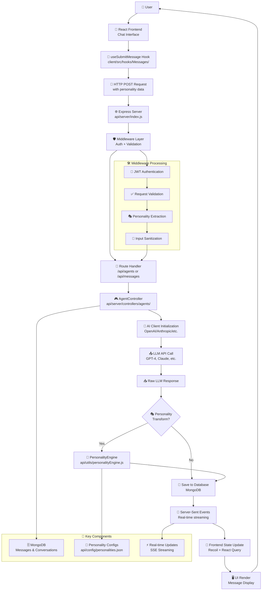

# LibreChat Message Flow Architecture

## Overview
This diagram illustrates how a user's chat message flows through the LibreChat system, from the frontend interface through to the LLM and back with a response.



## ASCII Architecture Flow

```
┌─────────────────────────────────────────────────────────────────────────────────────┐
│                        LibreChat Message Flow Architecture                          │
└─────────────────────────────────────────────────────────────────────────────────────┘

     [User]
       │
       │ 1. Types message
       ▼
   ┌─────────┐
   │ React   │◄─────────────────────────────────────────────────┐
   │Frontend │                                                  │
   │  Chat   │                                                  │
   └────┬────┘                                                  │
        │                                                       │
        │ 2. useSubmitMessage()                                 │
        │    + personality data                                 │
        ▼                                                       │
   ┌──────────┐                                                 │
   │ HTTP POST│                                                 │
   │ Request  │                                                 │
   └────┬─────┘                                                 │
        │                                                       │
        │ 3. /api/agents                                        │
        ▼                                                       │
   ┌──────────┐     ┌─────────────────┐                        │
   │ Express  │────▶│  Middleware     │                        │
   │ Server   │     │ ┌─────────────┐ │                        │
   │          │     │ │ JWT Auth    │ │                        │
   │          │     │ │ Validation  │ │                        │
   │          │     │ │ Personality │ │                        │
   └────┬─────┘     │ │ Extraction  │ │                        │
        │           │ └─────────────┘ │                        │
        │           └─────────────────┘                        │
        │                     │                                │
        │ 4. Route to         │                                │
        ▼    controller       ▼                                │
   ┌──────────┐         ┌─────────────┐                        │
   │ Agent    │         │  Database   │                        │
   │Controller│◄────────┤  MongoDB    │                        │
   │          │         │             │                        │
   └────┬─────┘         └─────────────┘                        │
        │                                                      │
        │ 5. Initialize AI Client                              │
        ▼                                                      │
   ┌──────────┐                                                │
   │ OpenAI/  │                                                │
   │Anthropic │                                                │
   │ Client   │                                                │
   └────┬─────┘                                                │
        │                                                      │
        │ 6. API Call                                          │
        ▼                                                      │
   ┌──────────┐                                                │
   │   LLM    │                                                │
   │ Provider │                                                │
   │(GPT-4/   │                                                │
   │ Claude)  │                                                │
   └────┬─────┘                                                │
        │                                                      │
        │ 7. Raw Response                                      │
        ▼                                                      │
   ┌──────────┐     ┌─────────────────┐                       │
   │Personality◄─────┤ personalities   │                       │
   │Transform │     │     .json       │                       │
   │ Engine   │     │                 │                       │
   │          │     │ ┌─────────────┐ │                       │
   └────┬─────┘     │ │ Enthusiastic│ │                       │
        │           │ │ Professional│ │                       │
        │           │ │ Encouraging │ │                       │
        │           │ │ Neutral     │ │                       │
        │           │ └─────────────┘ │                       │
        │           └─────────────────┘                       │
        │                                                     │
        │ 8. Transformed Response                             │
        ▼                                                     │
   ┌──────────┐                                               │
   │ Save to  │                                               │
   │ Database │                                               │
   │          │                                               │
   └────┬─────┘                                               │
        │                                                     │
        │ 9. Server-Sent Events                              │
        ▼                                                     │
   ┌──────────┐                                               │
   │Real-time │                                               │
   │Streaming │                                               │
   │          │                                               │
   └────┬─────┘                                               │
        │                                                     │
        │ 10. State Update                                    │
        ▼                                                     │
   ┌──────────┐                                               │
   │ Recoil + │                                               │
   │React     │                                               │
   │ Query    │                                               │
   └────┬─────┘                                               │
        │                                                     │
        │ 11. UI Render                                       │
        ▼                                                     │
   ┌──────────┐                                               │
   │ Message  │───────────────────────────────────────────────┘
   │ Display  │
   │          │
   └──────────┘

Legend:
───► Direct flow        
◄─── Data source       
┌───┐ Component        
│   │ or Service       
└───┘                  
```

## Simplified ASCII Flow

```
User Input → Frontend → HTTP Request → Middleware → Controller
    ↑                                                     ↓
    │                                               AI Client
    │                                                     ↓
    │                                               LLM Provider
    │                                                     ↓
    │                                               Raw Response
    │                                                     ↓
    │                                           Personality Engine
    │                                                     ↓
UI Update ← SSE Stream ← Database Save ← Transformed Response
```

## Detailed Flow Breakdown

### 1. **Frontend Initiation** (`client/src/`)
- User types message in chat interface
- `useSubmitMessage` hook captures the submission
- Personality selection from localStorage is included
- HTTP POST request sent to backend

### 2. **Server Entry Point** (`api/server/index.js`)
- Express server receives the request
- Middleware stack processes:
  - JWT authentication verification
  - Request validation and sanitization
  - CORS handling
  - Input size limits

### 3. **Routing Layer** (`api/server/routes/`)
- Request routed to appropriate handler:
  - `/api/agents` for agent-based conversations
  - `/api/messages` for direct message operations
  - Personality data passed through request body

### 4. **Controller Processing** (`api/server/controllers/agents/`)
- `AgentController` orchestrates the conversation flow
- Extracts personality preference from request
- Initializes appropriate AI client (OpenAI, Anthropic, etc.)
- Manages conversation context and history

### 5. **AI Provider Communication**
- Client makes API call to configured LLM service
- Original user message sent with conversation context
- Raw response received from AI provider

### 6. **Personality Transformation** (`api/utils/personalityEngine.js`)
- If non-neutral personality selected:
  - Raw LLM response passed to personality engine
  - Secondary LLM call transforms response style/tone
  - Personality-infused response returned
- If neutral personality: response passed through unchanged

### 7. **Data Persistence** (`MongoDB`)
- Both user message and AI response saved to database
- Conversation metadata updated
- Message relationships and branching maintained

### 8. **Real-time Response Delivery**
- Server-Sent Events stream response back to frontend
- Progressive response rendering for better UX
- Frontend state management (Recoil) updates in real-time

### 9. **UI Update** (`client/src/components/`)
- React components re-render with new message
- Message history updated
- UI reflects conversation state changes

## Key Architecture Benefits

### **Security & Control**
- Server-side personality processing prevents client-side tampering
- Authentication and authorization enforced at middleware level
- Input validation and sanitization protect against attacks

### **Performance & Scalability**
- Real-time streaming provides immediate user feedback
- Database persistence enables conversation history and resume
- Middleware caching reduces redundant processing

### **Modularity & Extensibility**
- Clean separation between frontend, middleware, and AI providers
- Personality engine is pluggable and configurable
- Multiple AI providers supported through unified client interface

### **Data Integrity**
- All personality transformations happen server-side
- Conversation branching and message relationships maintained
- Audit trail of all message transformations preserved